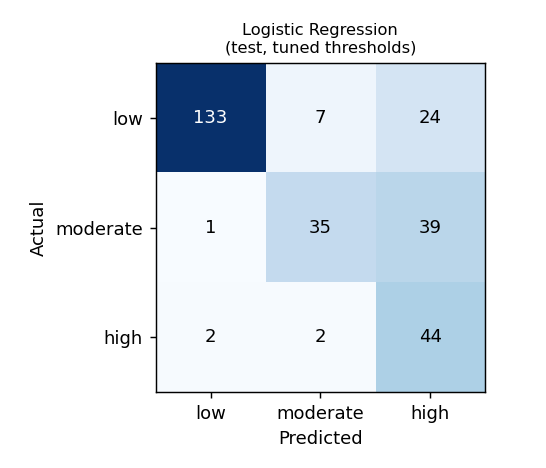
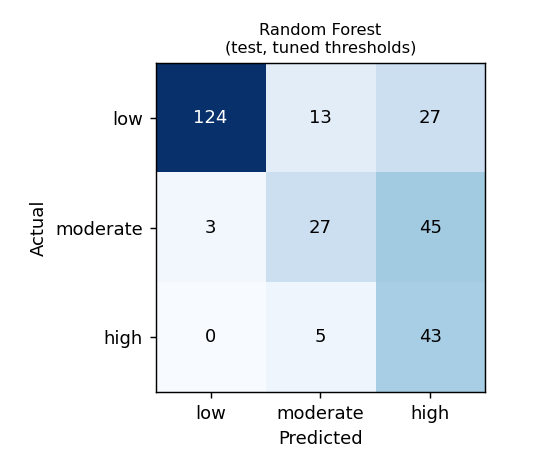
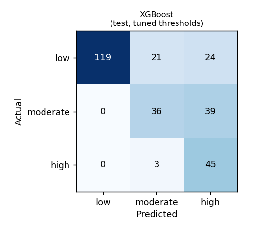
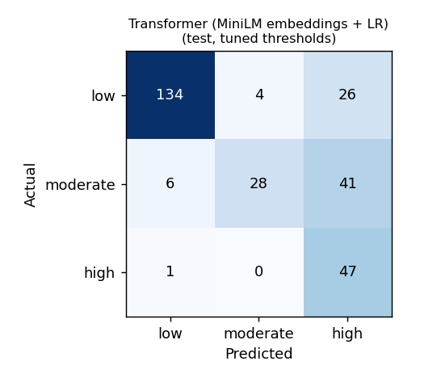
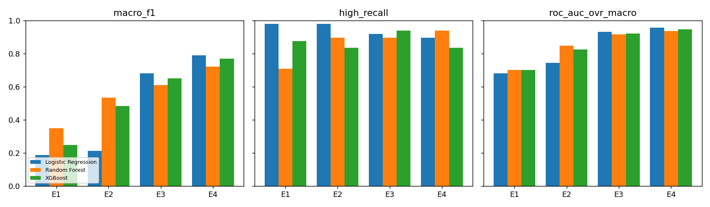

# Evaluation Report — Crisis-Risk Classification (transformer features)

Generated by `ml/train.py` on 2026-10-05. Model version: `transformer-2026-10-05-logistic`.

> Risk levels are model-generated indications, **not** clinical diagnoses. Metrics come from a small, public research dataset and do not establish real-world clinical validity.

## Dataset

1910 texts. CSSR-S severity 0 → Low, 1–2 → Moderate, 3–6 → High; everyday emotional statements from `dair-ai/emotion` added as Low. Stratified 70/15/15 split (by label × source).

| Split | Low | Moderate | High |
|---|---|---|---|
| train | 763 | 352 | 221 |
| val | 164 | 75 | 48 |
| test | 164 | 75 | 48 |

## Model comparison (held-out test set)

Decision thresholds tuned on the validation set to reach High recall ≥ 0.9 and at-risk (Moderate+High) recall ≥ 0.9 while maximising macro-F1. Selection uses validation metrics only — High recall first, then macro-F1; accuracy is not a criterion.

| Model | Accuracy | Macro P | Macro R | Macro F1 | ROC-AUC (OvR) | High recall | High precision | High FNR | High FPR | At-risk recall |
|---|---|---|---|---|---|---|---|---|---|---|
| Logistic Regression **(selected)** | 0.739 | 0.728 | 0.731 | 0.681 | 0.931 | 0.917 | 0.411 | 0.083 | 0.264 | 0.976 |
| Random Forest | 0.676 | 0.650 | 0.671 | 0.610 | 0.914 | 0.896 | 0.374 | 0.104 | 0.301 | 0.976 |
| XGBoost | 0.697 | 0.672 | 0.714 | 0.650 | 0.921 | 0.938 | 0.417 | 0.062 | 0.264 | 1.000 |
| Transformer (MiniLM embeddings + LR) | 0.728 | 0.746 | 0.723 | 0.661 | 0.942 | 0.979 | 0.412 | 0.021 | 0.280 | 0.943 |

### Same models with plain argmax decisions (no threshold tuning)

| Model | Accuracy | Macro F1 | High recall | High FNR |
|---|---|---|---|---|
| Logistic Regression | 0.808 | 0.758 | 0.583 | 0.417 |
| Random Forest | 0.770 | 0.695 | 0.417 | 0.583 |
| XGBoost | 0.756 | 0.690 | 0.562 | 0.438 |
| Transformer (MiniLM embeddings + LR) | 0.819 | 0.777 | 0.688 | 0.312 |

### CSSR-S posts only (harder subset — no everyday-emotion Low examples)

| Model | Macro F1 | ROC-AUC | High recall | High precision |
|---|---|---|---|---|
| Logistic Regression | 0.602 | 0.853 | 0.917 | 0.427 |
| Random Forest | 0.460 | 0.811 | 0.896 | 0.377 |
| XGBoost | 0.479 | 0.826 | 0.938 | 0.417 |
| Transformer (MiniLM embeddings + LR) | 0.573 | 0.872 | 0.979 | 0.423 |

### 5-fold cross-validation on train+val (argmax)

| Model | Macro F1 | ROC-AUC | High recall |
|---|---|---|---|
| Logistic Regression | 0.776 ± 0.026 | 0.939 ± 0.012 | 0.598 |
| Random Forest | 0.706 ± 0.015 | 0.928 ± 0.005 | 0.405 |
| XGBoost | 0.775 ± 0.026 | 0.942 ± 0.010 | 0.639 |
| Transformer (MiniLM embeddings + LR) | 0.795 ± 0.021 | 0.940 ± 0.011 | 0.710 |

### Hyperparameters and thresholds

| Model | Parameters | Thresholds (high / moderate) |
|---|---|---|
| Logistic Regression | C=3.0, class_weight=balanced, max_iter=3000 | 0.125 / 0.425 |
| Random Forest | class_weight=balanced_subsample, max_depth=None, min_samples_split=4, n_estimators=400 | 0.2 / 0.55 |
| XGBoost | colsample_bytree=0.5, learning_rate=0.08, max_depth=3, n_estimators=500, subsample=0.8 | 0.1 / 0.1 |
| Transformer (MiniLM embeddings + LR) | C=0.3, class_weight=balanced, max_iter=3000 | 0.175 / 0.6 |

### Confusion matrices (test, tuned thresholds)

## Feature-ablation study (SRS §13.2)

Each experiment retrains the model with the listed feature groups and re-tunes thresholds on validation. **E4 behavioural features are simulated** (`ml/behavioral.py`) because no public dataset pairs crisis text with mood logs; E4 shows that the pipeline can use such signals, not that they predict real risk, and the production model does not include them (behavioural history is applied as a transparent escalation rule at runtime instead).

**Logistic Regression**

| Experiment | Macro P | Macro R | Macro F1 | ROC-AUC | High recall | High precision | High FNR |
|---|---|---|---|---|---|---|---|
| E1 Sentiment | 0.380 | 0.375 | 0.186 | 0.679 | 0.979 | 0.180 | 0.021 |
| E2 +Emotion | 0.616 | 0.388 | 0.211 | 0.742 | 0.979 | 0.182 | 0.021 |
| E3 +Linguistic | 0.728 | 0.731 | 0.681 | 0.931 | 0.917 | 0.411 | 0.083 |
| E4 +Behavioral (synthetic) | 0.784 | 0.815 | 0.789 | 0.955 | 0.896 | 0.614 | 0.104 |

**Random Forest**

| Experiment | Macro P | Macro R | Macro F1 | ROC-AUC | High recall | High precision | High FNR |
|---|---|---|---|---|---|---|---|
| E1 Sentiment | 0.477 | 0.433 | 0.348 | 0.699 | 0.708 | 0.207 | 0.292 |
| E2 +Emotion | 0.619 | 0.604 | 0.532 | 0.846 | 0.896 | 0.297 | 0.104 |
| E3 +Linguistic | 0.650 | 0.671 | 0.610 | 0.914 | 0.896 | 0.374 | 0.104 |
| E4 +Behavioral (synthetic) | 0.729 | 0.766 | 0.720 | 0.936 | 0.938 | 0.517 | 0.062 |

**XGBoost**

| Experiment | Macro P | Macro R | Macro F1 | ROC-AUC | High recall | High precision | High FNR |
|---|---|---|---|---|---|---|---|
| E1 Sentiment | 0.494 | 0.390 | 0.248 | 0.701 | 0.875 | 0.184 | 0.125 |
| E2 +Emotion | 0.559 | 0.551 | 0.481 | 0.823 | 0.833 | 0.270 | 0.167 |
| E3 +Linguistic | 0.672 | 0.714 | 0.650 | 0.921 | 0.938 | 0.417 | 0.062 |
| E4 +Behavioral (synthetic) | 0.756 | 0.790 | 0.768 | 0.947 | 0.833 | 0.625 | 0.167 |

## Runtime safety layer (applies on top of every model)

- Explicit crisis language (`app/nlp/crisis.py`) always forces **High**, whatever the model says.
- A Low prediction is raised to Moderate when the user has a recent High-risk interaction or a sustained, declining low mood.
- High-risk replies use fixed, reviewed safety templates rather than generated text.

## Limitations

- The test set is small (tens of High examples), so expect wide confidence intervals; the CV table gives a sense of variance.
- CSSR-S labels come from one subreddit; the Low class mixes in a different source (short tweets), which makes Low easier to separate than it would be in real use — see the CSSR-S-only table.
- English only; sarcasm, indirect language and cultural variation are not covered.
