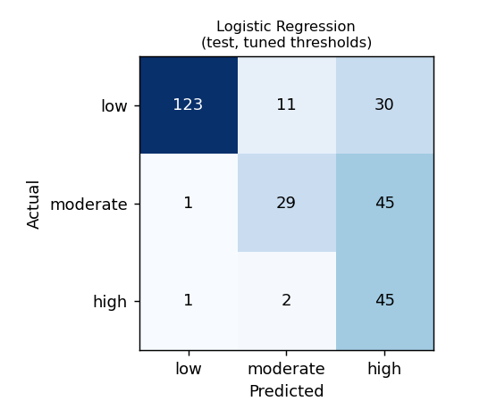
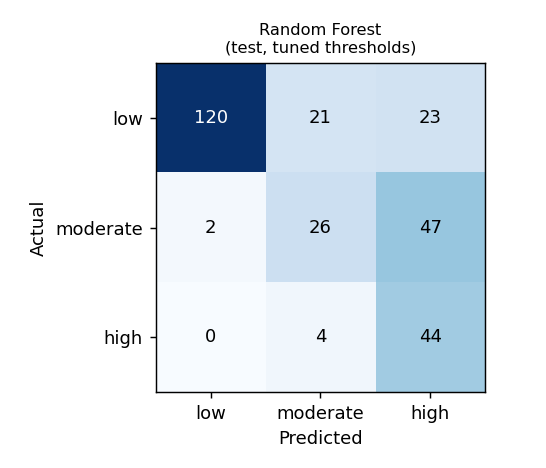
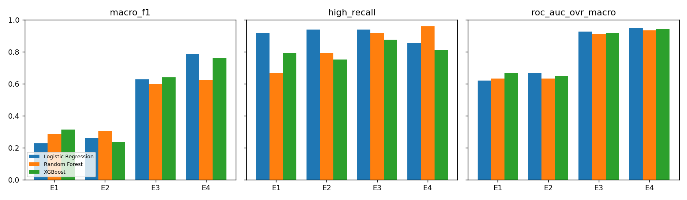

# Evaluation Report — Crisis-Risk Classification (lexicon features)

Generated by `ml/train.py` on 2026-10-05. Model version: `lexicon-2026-10-05-random`.

> Risk levels are model-generated indications, **not** clinical diagnoses. Metrics come from a small, public research dataset and do not establish real-world clinical validity.

## Dataset

1910 texts. CSSR-S severity 0 → Low, 1–2 → Moderate, 3–6 → High; everyday emotional statements from `dair-ai/emotion` added as Low. Stratified 70/15/15 split (by label × source).

| Split | Low | Moderate | High |
|---|---|---|---|
| train | 763 | 352 | 221 |
| val | 164 | 75 | 48 |
| test | 164 | 75 | 48 |

## Model comparison (held-out test set)

Decision thresholds tuned on the validation set to reach High recall ≥ 0.9 and at-risk (Moderate+High) recall ≥ 0.9 while maximising macro-F1. Selection uses validation metrics only — High recall first, then macro-F1; accuracy is not a criterion.

| Model | Accuracy | Macro P | Macro R | Macro F1 | ROC-AUC (OvR) | High recall | High precision | High FNR | High FPR | At-risk recall |
|---|---|---|---|---|---|---|---|---|---|---|
| Logistic Regression | 0.686 | 0.683 | 0.691 | 0.628 | 0.925 | 0.938 | 0.375 | 0.062 | 0.314 | 0.984 |
| Random Forest **(selected)** | 0.662 | 0.626 | 0.665 | 0.598 | 0.911 | 0.917 | 0.386 | 0.083 | 0.293 | 0.984 |
| XGBoost | 0.690 | 0.655 | 0.696 | 0.640 | 0.914 | 0.875 | 0.412 | 0.125 | 0.251 | 0.992 |

### Same models with plain argmax decisions (no threshold tuning)

| Model | Accuracy | Macro F1 | High recall | High FNR |
|---|---|---|---|---|
| Logistic Regression | 0.794 | 0.735 | 0.542 | 0.458 |
| Random Forest | 0.760 | 0.680 | 0.396 | 0.604 |
| XGBoost | 0.756 | 0.692 | 0.562 | 0.438 |

### CSSR-S posts only (harder subset — no everyday-emotion Low examples)

| Model | Macro F1 | ROC-AUC | High recall | High precision |
|---|---|---|---|---|
| Logistic Regression | 0.538 | 0.844 | 0.938 | 0.402 |
| Random Forest | 0.441 | 0.804 | 0.917 | 0.386 |
| XGBoost | 0.465 | 0.810 | 0.875 | 0.412 |

### Hyperparameters and thresholds

| Model | Parameters | Thresholds (high / moderate) |
|---|---|---|
| Logistic Regression | C=3.0, class_weight=balanced, max_iter=3000 | 0.1 / 0.375 |
| Random Forest | class_weight=balanced_subsample, max_depth=20, min_samples_split=4, n_estimators=400 | 0.225 / 0.45 |
| XGBoost | colsample_bytree=0.5, learning_rate=0.08, max_depth=3, n_estimators=500, subsample=0.8 | 0.1 / 0.1 |

### Confusion matrices (test, tuned thresholds)

## Feature-ablation study (SRS §13.2)

Each experiment retrains the model with the listed feature groups and re-tunes thresholds on validation. **E4 behavioural features are simulated** (`ml/behavioral.py`) because no public dataset pairs crisis text with mood logs; E4 shows that the pipeline can use such signals, not that they predict real risk, and the production model does not include them (behavioural history is applied as a transparent escalation rule at runtime instead).

**Logistic Regression**

| Experiment | Macro P | Macro R | Macro F1 | ROC-AUC | High recall | High precision | High FNR |
|---|---|---|---|---|---|---|---|
| E1 Sentiment | 0.310 | 0.387 | 0.227 | 0.620 | 0.917 | 0.190 | 0.083 |
| E2 +Emotion | 0.474 | 0.407 | 0.260 | 0.666 | 0.938 | 0.194 | 0.062 |
| E3 +Linguistic | 0.683 | 0.691 | 0.628 | 0.925 | 0.938 | 0.375 | 0.062 |
| E4 +Behavioral (synthetic) | 0.777 | 0.805 | 0.786 | 0.949 | 0.854 | 0.651 | 0.146 |

**Random Forest**

| Experiment | Macro P | Macro R | Macro F1 | ROC-AUC | High recall | High precision | High FNR |
|---|---|---|---|---|---|---|---|
| E1 Sentiment | 0.438 | 0.374 | 0.285 | 0.632 | 0.667 | 0.180 | 0.333 |
| E2 +Emotion | 0.456 | 0.421 | 0.303 | 0.632 | 0.792 | 0.207 | 0.208 |
| E3 +Linguistic | 0.626 | 0.665 | 0.598 | 0.911 | 0.917 | 0.386 | 0.083 |
| E4 +Behavioral (synthetic) | 0.629 | 0.691 | 0.625 | 0.933 | 0.958 | 0.460 | 0.042 |

**XGBoost**

| Experiment | Macro P | Macro R | Macro F1 | ROC-AUC | High recall | High precision | High FNR |
|---|---|---|---|---|---|---|---|
| E1 Sentiment | 0.510 | 0.406 | 0.312 | 0.667 | 0.792 | 0.182 | 0.208 |
| E2 +Emotion | 0.438 | 0.360 | 0.234 | 0.650 | 0.750 | 0.182 | 0.250 |
| E3 +Linguistic | 0.655 | 0.696 | 0.640 | 0.914 | 0.875 | 0.412 | 0.125 |
| E4 +Behavioral (synthetic) | 0.762 | 0.777 | 0.760 | 0.941 | 0.812 | 0.582 | 0.188 |

## Runtime safety layer (applies on top of every model)

- Explicit crisis language (`app/nlp/crisis.py`) always forces **High**, whatever the model says.
- A Low prediction is raised to Moderate when the user has a recent High-risk interaction or a sustained, declining low mood.
- High-risk replies use fixed, reviewed safety templates rather than generated text.

## Limitations

- The test set is small (tens of High examples), so expect wide confidence intervals; the CV table gives a sense of variance.
- CSSR-S labels come from one subreddit; the Low class mixes in a different source (short tweets), which makes Low easier to separate than it would be in real use — see the CSSR-S-only table.
- English only; sarcasm, indirect language and cultural variation are not covered.
